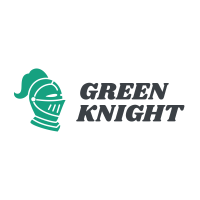
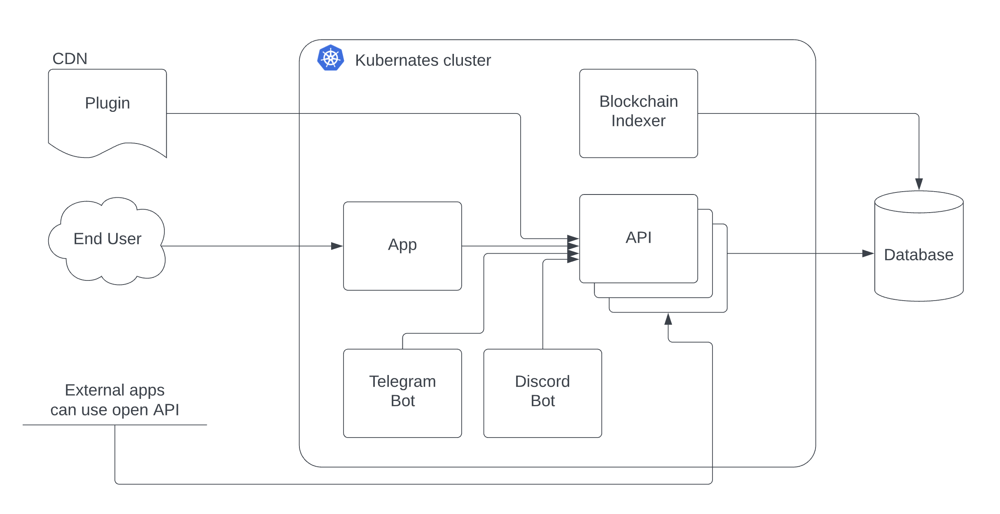

# Green Knight Protect for Tezos Blockchain

_Authored by Nikita Getman for Tezos DeFi Hackathon 2022_

[](https://opensource.org/licenses/MIT)



[RUS version of this file](./README_ru.md)

[Demo](http://84.201.184.103/)

This service allows you to identify the user's balance in the target FA1.2 or FA2 tokens in the Tezos blockchain and provides access to Telegram and Discord channels, or HTTP resources. To gain access, the user must connect the wallet and sign the data to confirm ownership of the wallet. If the user has enough target tokens, he will be able to access the resource.

You can use Green Knight as a SaaS solution.  
The service also provides [open API](./backend/), which allows other applications to check the wallet balance of target tokens.

Also, you can use the [Green Knight Plugin](./plugin/) in your web application, which will allow you to verify that users using your application have a sufficient number of tokens.

## Features:

1. **Granting access based on the user's balance.** Providing access to HTTP resources, or Telegram and Discord communities based on the user's balance in Tezos blockchain.
2. **Unique resources for each NFT.** You can set up a separate resource links for each tokenId of FA2 token (for example, to provide unique resources for the owners of your NFT).
3. **Bots for communities.** Bots for Telegram and Discord can moderate the participants of your groups based on their balance. Add users only with a sufficient balance of target tokens. Delete users after their balance has fallen below the required level.
4. **Plugin for web applications.** The Green Knight plugin makes it easy to embed a user balance check into your web application. It may be useful if you want to restrict access to parts of your web application for users with insufficient number of FA1.2 or FA2 tokens.
5. **Open API.** Other apps in Tezos ecosystem can use the Green Knight API to check the user's balance.

## Architecture

The application consists of several modules:

- [Web app](./frontend/)
- [Blockchain indexer](./indexer/)
- [API](./backend/)
- [Telegram Bot](./bots/)
- [Discord Bot](./bots/)
- [Plugin CDN](./plugin/)

> _Note: in prototype version the indexer is implemented on TzKT API. Bots for messengers are not implemented in the prototype._

### App scheme



## Roadmap

Q1 2022:

- Green Knight prototype launch

Q2 2022:

- Grow the development team
- Implementation of a local blockchain indexer
- Launching a Telegram bot
- Public alpha-version release

Q3 2022:

- New Supported Tezos Wallets
- Launching a Discord bot
- Integration with various ecosystem projects

Q4 2022:

- Launching a referral program
- Launching of the monetization model

Q1 2023:

- ...

## Deployment

Docker-compose is used to simplify working with containers. In the future, k8s will be used instead.

```
docker-compose up
```

## Have a question?

Feel free to contact me via:

- Telegram: https://t.me/nikita_getman
- Email: nikita.getman56@gmail.com

Cheers! 🍺
